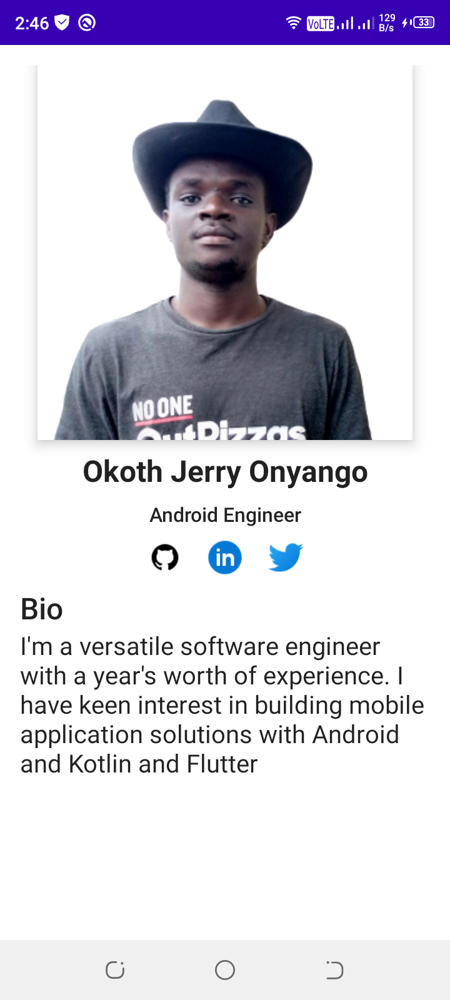

# HNG Reume
  This i a mobile version of my reume built with Android, Kotlin and Jetpack compose. It's an assignment task for stage 2 mobile track of the HNGi9 internship
  
# Design
  The application design i self created but influenced to a certain extent by the task's project design sample.
  
  

# Features
  - MainScreen - This is the main screen of the app showing my profile image, role, social media links and my bio description
  - TODO
  
    Features yet to be worked on
    - About Screen - A dedicated screen to include my detail bio and technical skills
    - Expirience Screen - The screen to list my work expreience
    - Projects Screen - The creen list the projects I've worked on
    - Theming - Update to a proper theme to include dark and light themes and a mores appealing typography
    - Localization - Add locatization feature including languages, etc
    - Resume Builder - Upgrade the project to be use users dynamic data to generate an exportable resume document
    
# Tech Stack
 - Android 
 - Kotlin
 - Jetpack Compose

# How to run the app
  1.To run the app and look at the codebase, you can either clone the repository locally with ``` git clone https://github.com/JerryMatera/hng-resume.git``` and open the project with android studio.
  2 .
 
# Challenges
 - With little experience on XML or Compose which made accomplishing the task hard regardles of the choice, i had to learn to learn Jetpack compose within the deadline inorder to do the task.
 - While searching for designs on dribble lots of the were complicated and didn't fit my needs so i had to design my own layout but i still could get the theming right.
 
